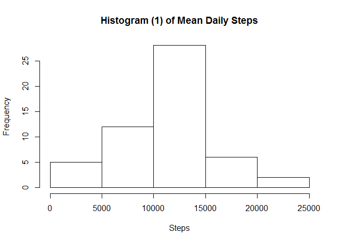
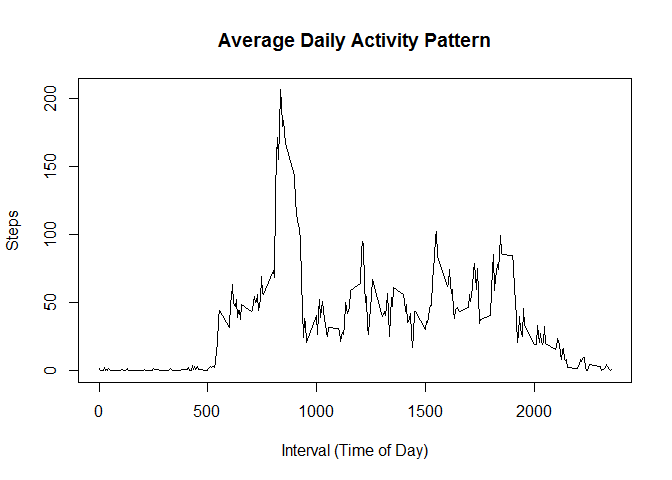

# Reproducible Research: Peer Assessment 1

## Introduction

This paper analyzes data from a personal activity monitoring device. This device collects data at 5 minute intervals through out the day. The data consists of two months of data from an anonymous individual collected during the months of October and November, 2012 and include the number of steps taken in 5 minute intervals each day.  The dataset can be downloaded from the course web site: [Activity monitoring data (52K)](https://d396qusza40orc.cloudfront.net/repdata%2Fdata%2Factivity.zip).

The variables included in this dataset are:

* steps: Number of steps taking in a 5-minute interval (missing values are coded as NA)
* date: The date on which the measurement was taken in YYYY-MM-DD format
* interval: Identifier for the 5-minute interval in which measurement was taken encoded as pseudo times in the form "hhmm" without leading zeros.

The dataset is stored in a comma-separated-value (CSV) file and there are a total of 17,568 observations.

This analysis will examine the total and average steps and the daily activity pattern. The initial analysis will ignore missing data which will later be imputed and reanalyzed including a deeper look at variations in activity over weekdays and weekends.

## Loading and preprocessing the data

*The following R libraries are required to process the code in this markdown file. They are preloaded first to eliminate warning notices in the later code sections.*


```r
    library(ggplot2)
    library(dplyr)
```

```
## Warning: package 'dplyr' was built under R version 3.2.4
```

```
## 
## Attaching package: 'dplyr'
```

```
## The following objects are masked from 'package:stats':
## 
##     filter, lag
```

```
## The following objects are masked from 'package:base':
## 
##     intersect, setdiff, setequal, union
```

```r
    library(chron)
```

```
## Warning: package 'chron' was built under R version 3.2.4
```

Source data was provided in a zip file and should be preloaded into the working directory. If the unzipped CSV file is not present, unzip it and read into a dataframe as follows.


```r
    file <- "activity.csv"
    if(!file.exists(file)) {
        unzip("activity.zip", list = TRUE)
        unzip("activity.zip", list = FALSE, overwrite = TRUE) 
    }
    df <- read.csv(file)
```

After studying the data in the source file, I have decided **not to add any preprocessing of the data**. Some options include converting the date strings to a date format and possibly converting the interval number to a factor. Note that the interval number is in the format of "hhmm" (without leading zeros) which results in gaps when the data is plotted (e.g., the interval numbers skip from 1055 to 1100, etc, at each hour. Nevertheless, the data can be examined and processed accurately in the provided format.

## What is mean total number of steps taken per day? 

The following **histogram** shows the daily activity summarized over all days in the study. The subject completes between 10000 and 15000 steps most frequently (~25% of the time). **The average (mean) number of steps per day is 10766.19, almost identical to the median number of 10765**.  Note these results exclude 8 days where no data was recorded.


```r
    library(dplyr)
    group_by(df, date) %>% summarize(steps = sum(steps)) -> activity.day
    hist(activity.day$steps, main = "Histogram (1) of Mean Daily Steps", xlab = "Steps")
```



```r
    mean(activity.day$steps, na.rm=TRUE)
```

```
## [1] 10766.19
```

```r
    median(activity.day$steps, na.rm=TRUE)
```

```
## [1] 10765
```

## What is the average daily activity pattern?

Looking at the level of activity throughout a typical day, again averaged over the two months in this study, we see the subject is most active between 08:00 and 09:00 with smaller activity peaks around 12:00 Noon, 16:00, 17:00 and between 18:00 and 19:00. **Activity peaks on average during interval #140 (around 08:40)**. Perhaps the subject exercises in the morning, walks around lunch and is active again going home and performing evening chores - we are not provided any information to explain his activity patterns. Again, note these results exclude averages from 8 days where no data was recorded.
    

```r
    library(dplyr)
    group_by(df, interval) %>% summarize(steps = mean(steps, na.rm=TRUE)) -> activity.int
    plot(activity.int$interval, activity.int$steps, type = "l",
         main = "Average Daily Activity Pattern", xlab = "Interval (Time of Day)",
         ylab = "Steps")
```



```r
    which.max(activity.int$steps)
```

```
## [1] 104
```

```r
    # Given 5 minute intervals, interval 104 is 8:35 - 8:40
```

## Imputing missing values

Analysis of the dataset (results below) shows that the missing data affects only steps data - **2304 or 13% of all rows are missing**. The missing data is confined to 8 separate dates throughout the study period and there is no data for those entire days. All other dates contain complete data for all intervals.


```r
    mean(is.na(df$date)) # 0
```

```
## [1] 0
```

```r
    mean(is.na(df$interval)) # 0
```

```
## [1] 0
```

```r
    mean(is.na(df$steps)) # 0.1311475 (13%)
```

```
## [1] 0.1311475
```

```r
    sum(is.na(df$steps)) # 2304 of 17586 total rows are missing
```

```
## [1] 2304
```

```r
    group_by(df, date) %>% summarize(missing = mean(is.na(steps))) -> z
    z[z$missing > 0,] # shows 8 of 61 rows, but all are 100% NA
```

```
## Source: local data frame [8 x 2]
## 
##         date missing
##       (fctr)   (dbl)
## 1 2012-10-01       1
## 2 2012-10-08       1
## 3 2012-11-01       1
## 4 2012-11-04       1
## 5 2012-11-09       1
## 6 2012-11-10       1
## 7 2012-11-14       1
## 8 2012-11-30       1
```

Therefore, there is no need to impute missing data between intervals. Instead, I will simply create a new copy of the dataset and apply the mean interval step values from all other days to the dates which are missing data. The mean interval step values were previously calculated for the daily activity pattern (**dataframe: activity.int**)


```r
    df2 <- df
    df2[is.na(df2$steps),]$steps <- activity.int$steps
    #Verify results
    mean(is.na(df2$steps)) # 0 meaning no more NA's
```

```
## [1] 0
```

Repeating the previous analysis of average daily steps shows...

The new **histogram** below again shows the daily activity summarized over all days in the study. As before, subject completes between 10000 and 15000 steps but **more frequently (~35%) than before** after imputing the missing data. **Since means were used to impute, the average (mean) number of steps per day is unchanged 10766.19, and the  median is now also 10766.19**. Note there is now complete data used for these results.


```r
    library(dplyr)
    group_by(df2, date) %>% summarize(steps = sum(steps)) -> activity2.day
    hist(activity.day$steps, main = "Histogram (2) of Mean Daily Steps", xlab = "Steps")
```


```r
    mean(activity2.day$steps, na.rm=TRUE)
```

```
## [1] 10766.19
```

```r
    median(activity2.day$steps, na.rm=TRUE)
```

```
## [1] 10766.19
```

## Are there differences in activity patterns between weekdays and weekends?

Seprating the data between weekdays and weekends shows some differences in the subject's actvity level. Weekday activity is generally more consistent during the waking hours while weekends clearly show the largest peak in the morning (8-9) with lower peaks during the rest of the day.
    

```r
    library(ggplot2)
    library(dplyr)
    library(chron)
    df2$daytype <- factor(is.weekend(df2$date), levels=c(FALSE, TRUE), 
                          labels=c('weekday', 'weekend'))
    group_by(df2, daytype, interval) %>% summarize(steps = mean(steps, na.rm=TRUE))-> activity2.int
    p <- qplot(interval, steps, data = activity2.int, geom = "line", 
               facets = daytype ~ .)
    print(p)
```


Please contact the author for more information about this analysis.
